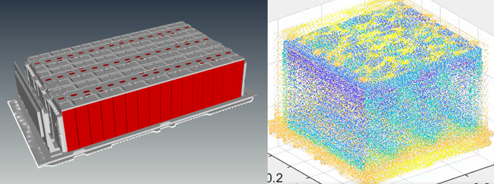
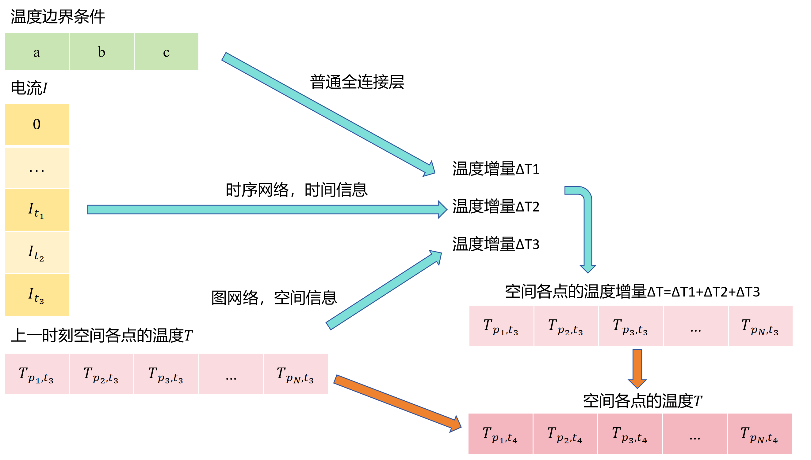

# GAT-LSTM For Lithium-Ion Battery Temperature Field Prediction

This Project belongs to Nanchang Innovation Institute, Peking University.

The code was developed by P.H. Zhang (2024).

## Background

Accurately predicting the temperature fluctuations of lithium-ion batteries has become a crucial challenge in enhancing battery performance and ensuring the safety of electric vehicles. The temperature of lithium-ion batteries are influenced by lots of factors, such as material, charge-discharge and environment. We aims to design AI algorithm to predict the temperature fluctuations under given conditions.

Traditional methods use simulation software to solve the thermodynamic equation. However, simulation software are slow, cumbersome, and having high learning threshold. A new approach is to use neural networks as surrogation of simulation software, which has high computational efficiency, significantly reduce time costs.

## Abstract

We trained GAT-LSTM as AI surrogate model to solve the problem.

This github repository contains the precedent work for paper: *The Lithium-Ion Battery Temperature Field Prediction Model Based on CNN-Bi-LSTM-AM* [doi.org/10.3390/su17052125](doi.org/10.3390/su17052125 "The Lithium-Ion Battery Temperature Field Prediction Model Based on CNN-Bi-LSTM-AM")


## Overview

- **Battery**: Lithium-ion battery package composed of several battery cells.
- **Datasets**: Use ESCAAS to do thermal simulation to make datasets.
- **AI model**: (*./model*) GAT-LSTM network, which can simultaneously observe and neatly integrate temporal and spatial information.

## File Structure

Files structure is as follows:

```
├── model                                   # AI model
    ├── GL_set.py                           # Model configuration file
    ├── graph_edge_index.py                 # Build graph from point cloud coordinates.
    ├── data_id_shuffle.py                  # Shuffle the datasets
    ├── data_process.py                     # Preprocess the datasets
    ├── GL_model.py                         # Model structure
    ├── training.py                         # Train AI model
    ├── training_v2.py                      # Train AI model (memory friendly)
    ├── testing_1.py                        # Test AI model for one time step
    ├── testing_2.py                        # Test AI model for all time steps
    └── ...
└── readme.md                               # This file  
```

## Datasets

### How to make datasets

- Model the lithium-ion battery package.
- Define sets of current curves and boundary conditions.
- For each set, use thermal simulation software to calculate the temperature field.

### Battery information

The lithium-ion battery package is as follows. 1 battery package contains 36 battery cells.

<p align="center"></p>

After mesh the battery package, we get 742,826 nodes and 3,013,738 elements.

### Thermal simulation

We use ESCAAS as the thermal simulation tool: [escaas.com.cn](escaas.com.cn "ESCAAS").

The temperature fluctuations of lithium-ion batteries follow the thermodynamic equation. $T$ is the temperature. $t$ is the time. $\rho$ is the mass density. $C_p$ is the heat capacity. $k$ is the thermal conductivity. $S$ is the heat generation power per unit mass. $q_c$ is the thermal conductivity power. $q_g$ is the heat generation power.

$$
\rho C_p \frac{\partial T}{\partial t} = q_c + q_g = -\nabla \cdot (k \nabla T) + \rho S_{(I, T)}
$$

$q_g$ has complicated correlation with temporal current $I$ and present temperature $T$. Therefore the temperature fluctuations of battery are influenced by current fluctuations.

### Permission

Due to confidentiality requirements, the download permission is restricted.

Download dataset [here](disk.pku.edu.cn/link/AA9BCF06CEBB9A4546B0FA8897632A9D3C "Peking University Disk") (restricted). If you are not from Peking University, you cannot visit Peking University Disk.

## AI model

### Input and output of neural networks

$$
(\mathbf{T_0}, \mathbf{I}, \mathbf{B})^\top \in (\mathbb{R}^{n}, \mathbb{R}^{m}, \mathbb{R}^{k})^\top
\overset{AI}{\longrightarrow}
(\mathbf{T_1}, \mathbf{T_2}, ... \mathbf{T_m})^\top \in \mathbb{R}^{m \times n}
$$

**Input**:

$\mathbf{T_0}$ is the initial temperature of all nodes on battery. $n$ is the number of nodes on battery. Ususlly, the initial temperature of battery is uniform distributed, by which $T^i_0 = T^j_0$.

$$
\mathbf{T_0} = (T^1_0, T^2_0, ...,T^n_0)^\top \in \mathbb{R}^{n}
$$

In the dataset, the initial temperature of battery is a constant value.

$\mathbf{I}$ is the current through the battery. $m$ is the total time step. $I_j$ is the current at time step $j$. $I_j > 0$ means charging while $I_j < 0$ means discharging. The battery may switch multiple times between charging and discharging throughout the time. The entire current curve $\mathbf{I}$ is given beforehand instead of being given time by time.


$$
\mathbf{I} = (I_0, I_1, ...,I_{m-1})^\top \in \mathbb{R}^{m}
$$

Define $h$ as the time step interval. The total time is $mh$. In this project, $m = 120$, $h=15 \, seconds$. The total time is $mh=1800 \, seconds$, namely half an hour.

$\mathbf{B}$ is the boundary condition of battery. There are $k$ boundary parameters. In most cases, the coolant temperature in pipelines and the ambient temperature is the necessary temperature boundary condition.

$$
\mathbf{B} = (B_0, B_1, ...,B_{k-1})^\top \in \mathbb{R}^{k}
$$

In this project, $k=4$. $B_0$ determines the ambient temperature, the unit of which is $K$. $(B_1, B_2, B_3)$ determines the coolant temperature in pipelines, the units of which are $(K, Km^{-1}, Km^{-2})$. In this project, the coolant temperature is regarded as only varying along x axis.

$$
T_{ambient} = B_0
$$
$$
T_{coolent} = B_1 + B_2 x + B_3 x^2
$$

**Output**:

$\mathbf{T_j}$ is the temperature of all nodes at time step $j$. 

$$
\mathbf{T_j} = (T^1_j, T^2_j, ...,T^n_j)^\top \in \mathbb{R}^{n}
$$

The output is an $m \times n$ matrix. If we predict all $n=742826$ nodes on battery, the output matrix will be very massive. To simplify the problem, we only predict a portion of nodes. After k-means clustering method, we select $n=1000$ nodes. Then the output matrix is significantly reduced, which enhance the model efficiency.

### Structure of neural networks

We combine Graph Attention Network (GAT) with Long Short-Term Memory (LSTM) to build our AI model. The GAT is responsible for capturing the spatial information while LSTM is reponsible for capturing the temporal information. GAT-LSTM network can observe both temporal and spatial information simultaneously and neatly integrate the information together.

The structure of GAT-LSTM network is as follows. The detailed code is available in *./model*.

<p align="center"></p>

We set sliding window to process temporal data. The length of sliding window is $L$. We take recent $L$ time steps data to predict next time step. So we make prediction step by step instead of using all $m$ time steps data at once. For the first few time steps, the recent number oftime steps is less than $L$ so that we use zero-paddings to extend to $L$.

## Run

Establish python environment.

```bash
conda create --name py312 python=3.12
conda activate py312
```

Download the datasets (if permitted).

Do settings in *./model/GL_set.py*.

Build graph from point cloud coordinates. Run the bash code to get *edge_index.csv* at *save_path*.

```bash
cd model/
python graph_edge_index.py
```

Then preprocess the dataset. Run the bash code to get *shuffle_id.csv* at *save_path* and he preprocessed data.

```bash
python data_id_shuffle.py
nohup python data_process.py &
```

Train AI model.

```bash
nohup python training.py &
```

Test AI model.

```bash
python testing_1.py
```

## License

This code is provided for educational and research purposes.


